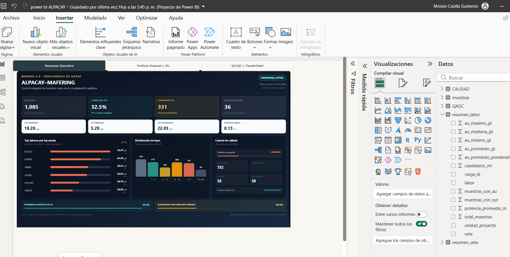
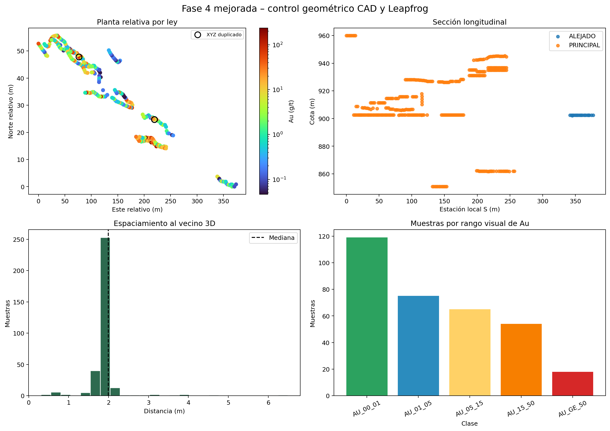
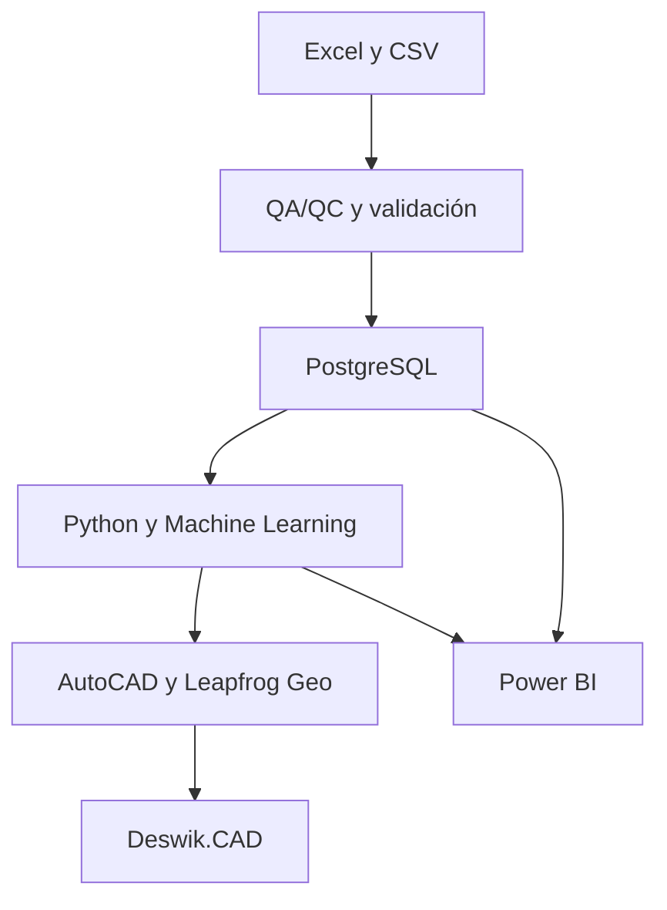

<div align="center">

# ⛏️ ALPACAY Mining 4.0

### Integración de datos geológicos, QA/QC, analítica espacial y software minero


**Caso técnico anonimizado para portafolio profesional de Ingeniería de Minas**

</div>

## Descripción

ALPACAY Mining 4.0 es un proyecto aplicado a control de leyes de oro en una operación subterránea de veta angosta. Integra limpieza y validación de datos, QA/QC, PostgreSQL, análisis con Python, evaluación de modelos de Machine Learning, preparación geométrica para software minero y visualización en Power BI.

El objetivo es demostrar un flujo reproducible de trabajo entre geología, base de datos, modelamiento y planeamiento, manteniendo una interpretación técnica prudente y trazable.

## 🎥 Demostración del proyecto

Vista resumida del flujo desarrollado en Excel, QA/QC, preparación analítica y AutoCAD:

https://github.com/user-attachments/assets/3fa1c52f-a277-4355-a7e9-50d4a3052282

## Evidencias visuales

### Dashboard de control en Power BI



### Control geométrico para integración CAD y 3D



## Arquitectura Mining 4.0



## Indicadores principales

| Indicador | Resultado |
|---|---:|
| Registros procesados | 1,085 |
| Registros con Au numérico | 1,018 |
| Muestras con XYZ completo | 353 |
| Cobertura espacial | 32.5 % |
| Registros QA/QC | 36 |
| Candidatos para ML | 331 |
| Mediana de Au | 3.00 g/t |
| Promedio de Au | 12.75 g/t |

> Los valores corresponden al conjunto analítico validado. Los resultados son exploratorios y no constituyen una estimación de recursos o reservas.

## Flujo de trabajo

1. **Ingreso y trazabilidad:** recepción del Excel de muestreo y control de estructura.
2. **QA/QC:** revisión de valores faltantes, duplicados, trazas, potencia y coordenadas.
3. **Base de datos:** carga por capas `raw`, `core`, `analytics` y `audit` en PostgreSQL.
4. **Analítica:** estadística descriptiva, distribución de Au y evaluación espacial con Python.
5. **Machine Learning:** comparación de modelos mediante validación aleatoria y espacial.
6. **Integración CAD/3D:** generación de archivos relativos para AutoCAD y Leapfrog Geo.
7. **Preplaneamiento:** preparación de tramos y capas de intercambio para Deswik.CAD.
8. **Business Intelligence:** indicadores técnicos y páginas de control en Power BI.

## Estructura del repositorio

```text
alpacay-mining-4.0/
├── README.md
├── .gitignore
├── 01_data_publica/
├── 02_qaqc/
├── 03_sql/
├── 04_python_ml/
├── 05_autocad/
├── 06_leapfrog/
├── 07_deswik/
├── 08_powerbi/
├── 09_reportes/
└── docs/
```

| Carpeta | Contenido |
|---|---|
| `01_data_publica` | Muestras anonimizadas y coordenadas relativas |
| `02_qaqc` | Notebook, resultados y figuras de control de calidad |
| `03_sql` | Esquemas, transformación CORE y vistas analíticas |
| `04_python_ml` | Notebook de ML, métricas y validación espacial |
| `05_autocad` | DXF público relativo, capas y control geométrico |
| `06_leapfrog` | Compositados, malla guía y documentación de importación |
| `07_deswik` | Tramos públicos y guía de preplaneamiento |
| `08_powerbi` | DAX, Power Query, tema visual y capturas del dashboard |
| `09_reportes` | Informe técnico y presentación del proyecto |
| `docs` | Metodología, guía de publicación y documentación adicional |

## Tecnologías

- **Datos:** Excel, CSV y PostgreSQL.
- **Programación:** Python, pandas, NumPy, scikit-learn y Jupyter/Google Colab.
- **Visualización:** Power BI, DAX, Power Query y HTML Content.
- **Software minero:** AutoCAD/Civil 3D, Leapfrog Geo y Deswik.CAD.
- **Control de versiones:** Git y GitHub.

## Resultados y criterio técnico

- Se consolidó un flujo reproducible desde datos de muestreo hasta productos analíticos y geométricos.
- La cobertura XYZ disponible limita el alcance espacial; por eso se diferencia entre análisis descriptivo y modelamiento predictivo.
- La validación espacial presentó capacidad predictiva baja, por lo que el ML se utiliza como apoyo exploratorio y priorización de revisión, no como reemplazo del criterio geológico.
- Los archivos CAD y 3D públicos usan referencias relativas y códigos anonimizados.

## Reproducibilidad

Los notebooks pueden abrirse en Jupyter o Google Colab. Para preparar el entorno de Python:

```bash
pip install -r requirements.txt
```

Los scripts SQL deben ejecutarse en orden:

```text
01_inicializar_raw_audit.sql
02_transformar_core.sql
03_vistas_powerbi_3d.sql
```

## Privacidad y limitaciones

- No se publica el Excel original ni información contractual u operativa sensible.
- Las coordenadas públicas son relativas o anonimizadas.
- Los archivos con la palabra `INTERNO`, credenciales, conexiones locales y modelos binarios permanecen fuera del repositorio.
- Este proyecto es académico y de portafolio. No reemplaza una estimación geológica, evaluación de recursos, reservas o diseño minero operativo.

## Estado del proyecto

| Componente | Estado |
|---|---|
| QA/QC y limpieza | ✅ Completado |
| PostgreSQL y vistas analíticas | ✅ Completado |
| Python y ML exploratorio | ✅ Completado |
| AutoCAD y consolidación geométrica | 🔄 En desarrollo |
| Leapfrog Geo | 🔄 Modelo exploratorio |
| Deswik.CAD | 🔄 Preplaneamiento |
| Power BI | ✅ Dashboard funcional |
| Automatización integral | 🧭 Siguiente etapa |

## Autor

**Moisés Ronaldo Casilla Gutiérres**  
Estudiante de Ingeniería de Minas — Universidad Nacional de San Agustín de Arequipa  
Técnico en Operaciones Mineras — Tecsup  

Este repositorio se actualiza progresivamente como evidencia de aprendizaje aplicado en minería, datos y transformación digital.

